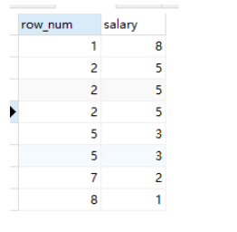

# 排名函数(窗口函数)

1. **ROW_NUMBER()**
   1. row_number在排名时序号 连续 不重复，即使遇到表中的两个3时亦如此
   2. **注意：在使用row_number实现分页时需要特别注意一点，over子句中的order by 要与Sql排序记录中的order by 保持一致，否则得到的序号可能不是连续的**
2. **RANK()**
   1. rank函数会把要求排序的值相同的归为一组且每组序号一样，排序不会连续
      执行
   2. 
3. **DENSE_RANK()**
   1. dense_rank排序是连续的，也会把相同的值分为一组且每组排序号一样
   2. 
4. **NTILE()**
   1. 作用：将查询数据分成group_num数目的组数，ntile(1)就是将查询数据分成一组，ntile(2)就是将查询数据分成二组，以此类推；
   2. 

# 替换函数replace()

​	**REPLACE(String,from_str,to_str) 即：将String中所有出现的from_str替换为to_str。**

**replace(列名，替换前内容，替换后内容)** \

> [ 力扣交换性别 中有个特殊用法](https://leetcode-cn.com/problems/swap-salary/solution/wei-shi-yao-yi-ding-yao-yong-if-or-case-when-by-sh/ )  update salary set sex = replace('mf',sex,"")  将字段 sex 的值 m 和f 进行了替换,🐂
>
> 

# 取模函数

**mod(X,Y)  rem(X,Y)**  这两个都是取模函数,mod函数是使用floor函数是向下取整的 rem函数采用fix函数,固定靠近 0的那个数

> mod(12,-5) = -3    mod(-12,5) = 3 
>
>   rem(12,-5) = 2    rem(-12,5) = -2
>
> >    mod(12,5) = 2
> >
> > ​         12/5 = 2.4 向下取整 ，为2； 12 - 5*2 = 2 ; 所以mod(12,5) = 2.
> >
> >   mod(12,-5) = -3
> >
> > ​         12/-5 = -2.4 向下取整，为-3;   12 - (-5)*(-3) = -3; 所以mod(12,-5) = -3.
>
>  显然mod(X,Y)的计算公式为：X - floor(X./Y).*Y
>
> >  rem(12,5) = 2
> >
> > ​          12/5 = 2.4 向0取整，为2;  12 - 5*2 = 2; 所以rem(12,5) = 2.
> >
> > ​       rem(12,-5) = 2
> >
> > ​          12/-5 = -2.4 向0取整，为-2;  12 - (-5)*(-2) = 2; 所以rem(12,-5) = 2.
> >
> > ​       rem(-12,5) = -2
> >
> > ​          -12/5 = -2.4 向0取整，为-2;  -12 - 5*(-2) = -2; 所以rem(12,5) = -2.
>
>    显然rem(X,Y)的计算公式为：X - fix(X./Y).*Y